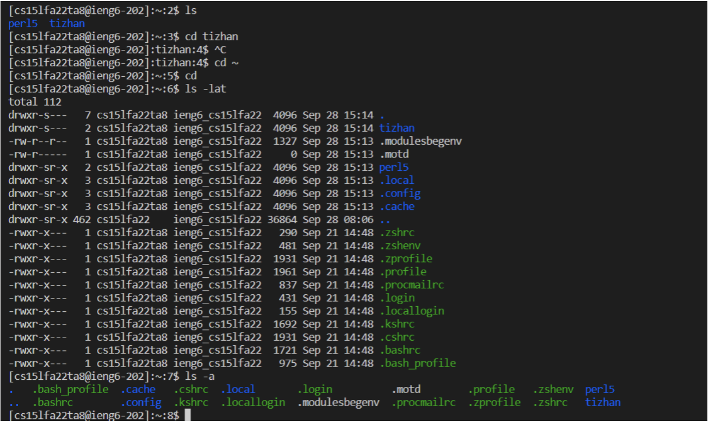

# Tutorial For How to use a course-specific account on **ieng6**

## Steps
1. Installing VScode
    - I did not do this step because both my laptop and the computer in cse lab already have VScode installed. 
    - Go to [Visual Studio Code website](https://code.visualstudio.com/) and follow their installation steps.

2. Remotely Connecting
    - Use this link to check for the account name for the specific course.
    - Then change the password of this account and use the newly changed password to access the remote computer.

    - In the screenshot, I used the TA account because I was not able to reset the password correctly during lab. I'm able to access the server using my own account now.
3. Trying some Comments
    - I tried out the commands `cd`, `ls -lat`, `ls -a` and `cd ~`. Running ls -lat shows the file/folder that exist in the current directory. It also shows the some information about these files, such as created date.

4. Moving Files with scp
    - I used the command `scp WhereAmI.java cs15lfa22ta8@ieng6.ucsd.edu:~/tizhan` to move the file from the local computer to the `~/tizhan` directory in the remote computer.
    - I was able to use compile and run the `WhereAmI.java` file with command `javac WhereAmI.java` and `java WhereAmI` on the remote server.

5. Setting an SSH Key
    - I used the command `ssh-keygen` and set everything as default.
    - Then, I login in to the remote computer and create a new directory called `.ssh`.
    - I moved the file called `id_rsa.pub` from `~/.ssh` in my local computer to the remote computer using the command `scp`.

6. Optimizing Remote Running
    - I was able to use only two command to move the file from local to remote, and compile and run in remote computer. I used `" "` and `;` to directly run two command on the remote computer at one time.
    - I did not figure out how to use less than 10 keystroke to perform this task, becuase typing `WhereAmI.java` already counts as 13 keystroke.
