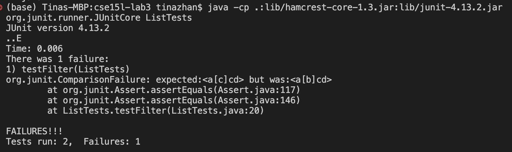

# Lab Report Week3
## Part1- Simplest Search Engine

### Code for the Search Engine is shown in the code block below:

```
import java.io.IOException;
import java.net.URI;
import java.util.ArrayList;

class Handler implements URLHandler {
    // The one bit of state on the server: a number that will be manipulated by
    // various requests.
    ArrayList<String> list = new ArrayList<>();

    public String handleRequest(URI url) {
        if (url.getPath().equals("/")) {
            String returned = "";
            for (String curr:list)
            {
                returned += curr + "\n";
            }
            return String.format("List is: %s", returned);
        } 
        else if (url.getPath().contains("/add")) {
            String[] parameters = url.getQuery().split("=");
                if (parameters[0].equals("s")) {
                    list.add(parameters[1]);
                    return String.format("String %s successful added to list.", parameters[1]);
                }
            return String.format("404 Not Found");
        } 
        else if (url.getPath().contains("/search")) {
            String[] parameters = url.getQuery().split("=");
                if (parameters[0].equals("s")) {
                    String result = "";
                    for (String curr:list)
                    {
                        if (curr.contains(parameters[1]))
                        {
                            result += curr + "\n";
                        }
                    }
                    return String.format("String returned \n %s", result);
                }
            return String.format("404 Not Found");
        }
        else {
            return "404 Not Found!";
        }
        
        //return "1";
    }
}

public class SearchEngine {
    public static void main(String[] args) throws IOException {
        if(args.length == 0){
            System.out.println("Missing port number! Try any number between 1024 to 49151");
            return;
        }

        int port = Integer.parseInt(args[0]);

        Server.start(port, new Handler());
    }
    
}
```

Image of using the Search Engine is shown below.

### Using the add feature


*Description*: The method ` handleRequest()` is called. The `url ` argument changes to ` http://localhost:4000/add?s=apple`. Thus, the returned value of the method `url.getPath()` also changes to `/add?s=apple`. Since the `url.getPath()` contains `/add`, we enter the first `else if` statement and get the query using `getQuery()` method. The query `s=apple` is splited with `=` sign. Since the first element in the query equals `s`, we enter the `if` statement. And the second element `apple` in the query is added to the ArrayList list field of our Handler class. A string `String %s successful added to list` is returned and `%s` is `apple` in this example. The returned string is shown on the web page.

### Using Search Engine without add and search

*Description*: The method ` handleRequest()` is called. The `url ` argument changes to ` http://localhost:4000`. Thus, the returned value of the method `url.getPath()` also changes to `/`. Since the `url.getPath()` equals `/`, we enter the first `if` statement. The ArrayList field `list` is accessed to add each string in the arraylist to a single string. Then, the string containing all the string from the `list` is returned, and thus, the web page shows the `List is: %s` where `%s` is replaced by the string.
### Using the Search feature

*Description*: The method ` handleRequest()` is called. The `url ` argument changes to ` http://localhost:4000/search?s=app`. Thus, the returned value of the method `url.getPath()` also changes to `/search?s=app`. Since the `url.getPath()` contains `/search`, we enter the second `else if` statement and get the query using `getQuery()` method. The query `s=app` is splited with `=` sign. Since the first element in the query equals `s`, we enter the `if` statement. Then, we check which string inside the field `list` contains the second element `app` in the query. If the string contains  `app`, it is added to a string called `result`. A string `String returned /n %s` is returned and `%s` replaced by the string `result`. In this case `%s` is `happy\napple\n`The returned string is shown on the web page.


## Part 2

### Example bug 1 - Reversed method
*Failure-inducing input*: 

*Symptom*:

*Bug*: This shows the bug fixed

Before fixing, there are two bugs:
`arr[i] = newArray[arr.length-i-1];`

`return arr`
*Explanation*: Instead of setting the `newArray[i]` to `arr[arr.length-i-1]`, the code does it backwards. Since newArray is a newly initialized array, every element at each index are just 0. So setting up the element in `arr` to equal to element in `newArray` will just get a array with all 0s. That's why the actual result of symptom has 0 at index 0.


### Example bug 2 - filter
*Failure-inducing input*: 

*Symptom*:

*Bug*:The picture shows the fixed code.

The line before fixing is `result.add(0,s);`
*Explanation*: The filter will filter out string with length less than or equal to 3. This line `result.add(0,s);` caused the symptom of getting `abcd` at index 1 when we should get `accd` since `accd ` should go after `abcd` based on the orignal position in the arraylist. The line `result.add(0,s);` kept adding the filtered element at index 0, so the order of list is reversed. 